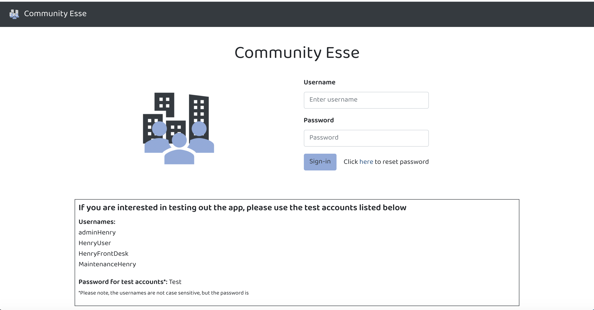

# Community Esse



## Overview

This project is a MERN (MySQL, Express, React, Node) application that allows property managers, workers, and tenants at real estate properties better communicate, manage and live in the communities. The app can handle multiple properties and users will only have access to activity for the property they are registered for.

The app has different user roles that allow users different access to features.

This app allows Property Managers (Admins) to:

- Register new users
- Upload building documents
- View tenant information
- View front desk and maintenance activity
- Message other users (tenants, front desk, maintenance)
- Post Announcements for everyone with access to the property to view.

This app allows Tenants (Users) to:

- Update their profile information
- View building documents
- View Front Desk notifications
- Submit Maintenance Requests
- Post to the property bulletin board
- Message other users (Admins, Front Desk, Maintenance, other tenants)
- View Announcements posted by Admins

This app allows Front Desk users (Front Desk) to:

- Send Front Desk notifications to Tenants when there is front desk activity such as receiving a package)
- Send messages to other users (Admins, Maintenance, tenants)

This app allows Maintenance users (Maintenance) to:

- View open maintenance requests
- Add notes to maintenance requests
- Close maintenance requests
- View closed maintenance requests
- Send messages to other users

Link to project: https://community.appsbymarcia.com

## Technologies Used

- Front-end:
  - ReactJS
  - JavaScript
  - Sass
  - Bootstrap

* Back-end
  - Node JS
  - Express
  - MySQL (Sequelize)

## Getting Started

1. Run git clone on the repository and open the project in your local directory
2. In your local directory, run a npm install in the root directory (for back-end dependencies) and the client folder (for front-end dependencies).

   The following packeges will be installed:

   - Back-end

     - axios
     - sequelize
     - mysql2
     - express
     - express-session
     - passport
     - passport-local
     - bcryptjs
     - cors
     - express-fileupload
     - if-env
     - node
     - node-fetch

   - Front-end
     - axios
     - bootstrap
     - node-sass
     - react
     - react-bootstrap
     - react-dom
     - react-router-dom
     - react-scripts
     * dateformat

3. Copy the code in db/schema.sql and paste into MySQL Workbench and run in order to create the CommunityLife_db database.

4. Change the config.json in the config folder to include your MySQL local host password in the development section:

```
"development": {
    "username": "root",
    "password": [INSERT PASSWORD HERE],
    "database": "CommunityLife_db",
    "host": "127.0.0.1",
    "dialect": "mysql"
  }

```

5. Run node server on the root directory. This will create the tables in MySQL workbench based on the Sequelize models in the models folder.

The following tables should be created:

- Users\*
- Announcements
- Bulletins
- Files
- Maintenances
- Messages
- Notifications
- Properties\*\*

\*Admins of properties can add other users to properties via the web interface but new Admins can only be added by the system admin on the backend.

\*\*The properties table can only be updated on the backend by the system admin. The system admin can add new properties and new admins for those properties.

6. Run npm start in your root directory to launch the app on localhost:3000

## Link to Project

View project here: https://community.appsbymarcia.com
